# 🚀 Projeto Amazon ECS - Deploy de Aplicação PHP com Arquitetura Cloud

## 📌 Sobre o Projeto

Este projeto demonstra a evolução completa de uma aplicação web em PHP, desde um ambiente local até uma arquitetura moderna em nuvem utilizando Amazon Web Services (AWS).

O foco principal é mostrar, na prática, a transformação de um sistema simples em uma solução escalável, segura e preparada para produção, utilizando conceitos de:

- ☁️ Cloud Computing  
- 🐳 Containers  
- ⚙️ DevOps  
- 🏗️ Arquitetura distribuída  


---

## 🧠 Objetivo do Projeto

- Demonstrar conhecimento prático em AWS  
- Aplicar boas práticas de arquitetura cloud  
- Trabalhar com containers (Docker + ECS)  
- Construir um projeto real de portfólio  
- Mostrar evolução técnica (Local → EC2 → ECS)  

---

## 🧱 Evolução do Projeto

### 🖥️ 1. Ambiente Local (XAMPP + Docker Desktop)

O projeto iniciou em ambiente local utilizando:

- XAMPP (Apache + MySQL + PHP)  
- Visual Studio Code  
- Docker Desktop (para build de imagens)  

### 🔧 O que foi feito:

- Desenvolvimento da aplicação PHP  
- Estrutura de login e cadastro de usuários  
- Banco de dados MySQL local  
- Criação do Dockerfile  
- Build da imagem local com Docker  
- Testes da aplicação em localhost  

---

## 🐳 Docker e Containerização

A aplicação foi preparada para rodar em container:

```dockerfile
FROM php:8.2-apache

RUN docker-php-ext-install mysqli

COPY . /var/www/html/

RUN chown -R www-data:www-data /var/www/html

EXPOSE 80
````

### 🔄 Processo:

**Build da imagem local:**

```bash
docker build -t ecr-php-app .
```

**Tag da imagem:**

```bash
docker tag ecr-php-app:latest <account-id>.dkr.ecr.us-east-1.amazonaws.com/ecr-php-app:v1
```

**Push para o ECR:**

```bash
docker push <account-id>.dkr.ecr.us-east-1.amazonaws.com/ecr-php-app:v1
```

---

## ☁️ 2. Infraestrutura com EC2

Após o ambiente local, o projeto foi migrado para AWS utilizando:

* EC2 (Linux + Apache + PHP)
* RDS (MySQL)
* VPC (rede isolada)
* Security Groups

### 🔧 Componentes criados:

* Instância EC2 (php-app)
* Bastion Host para acesso seguro
* Banco de dados no RDS
* Configuração de rede (VPC + Subnets)

### 📌 Melhorias:

* Aplicação acessível via internet
* Banco gerenciado
* Separação de rede
* Segurança aprimorada

---

## 🌐 3. Arquitetura com ALB + DNS + CDN

Evolução da arquitetura para alta disponibilidade:

### 🔧 Serviços utilizados:

* Application Load Balancer (ALB)
* Target Group
* Route 53 (DNS)
* CloudFront (CDN)
* WAF (proteção)

### 📌 Benefícios:

* Balanceamento de carga
* Alta disponibilidade
* Distribuição global (CDN)
* Segurança adicional (WAF)
* Uso de domínio personalizado

---

## 🚀 4. Arquitetura Final com ECS (Fargate)

A aplicação foi modernizada com containers:

### 🔧 Serviços utilizados:

* ECS (Elastic Container Service)
* Fargate (serverless)
* ECR (container registry)

### 📌 Configuração:

* Launch type: Fargate
* CPU: 0.5 / 1 vCPU
* Memória: 1GB / 3GB
* Porta: 80
* Rede: awsvpc
* Subnets públicas
* IP público habilitado

---

## 🧱 Arquitetura Final

```text
Usuário
   ↓
CloudFront + WAF
   ↓
Route 53 (DNS)
   ↓
Application Load Balancer
   ↓
ECS (Fargate - Containers PHP)
   ↓
RDS (MySQL)
```

---

## 📂 Estrutura do Projeto

```text
ecs/
├── config/
│   └── database.php
├── lib/
├── images/
├── index.php
├── login.php
├── cadastro.php
├── bootstrap.php
├── styles-devops.css
├── script-devops.js
└── Dockerfile
```

---

## 🗄️ Banco de Dados (RDS)

Banco MySQL gerenciado na AWS.

### 🔧 Variáveis de ambiente:

```env
DB_HOST=xxxxx.rds.amazonaws.com
DB_NAME=db_website_php
DB_USER=admin
DB_PASS=******
DB_PORT=3306
```

---

## ⚙️ Configuração no ECS

As variáveis foram configuradas diretamente na Task Definition:

* DB_HOST
* DB_NAME
* DB_USER
* DB_PASS
* DB_PORT

---

## 🔐 Segurança

* Security Groups separados:

  * ECS
  * RDS
  * ALB
* Banco em subnet privada
* Acesso ao RDS apenas via ECS
* Uso de WAF para proteção web
* Sem credenciais expostas no código

---

## 🧪 Testes Realizados

* Acesso via navegador (HTTP/HTTPS)
* Teste de login e cadastro
* Conexão com banco validada
* Aplicação funcionando via domínio

---

## 💻 Ambiente de Desenvolvimento

Ferramentas utilizadas:

* Visual Studio Code
* Docker Desktop
* Navegador
* MySQL Client

---

## 📸 Fotos do Projeto

<p align="center">
  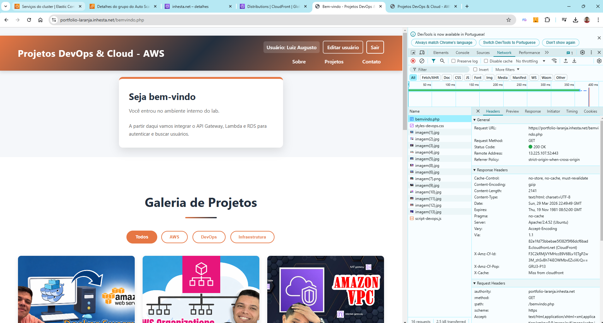
  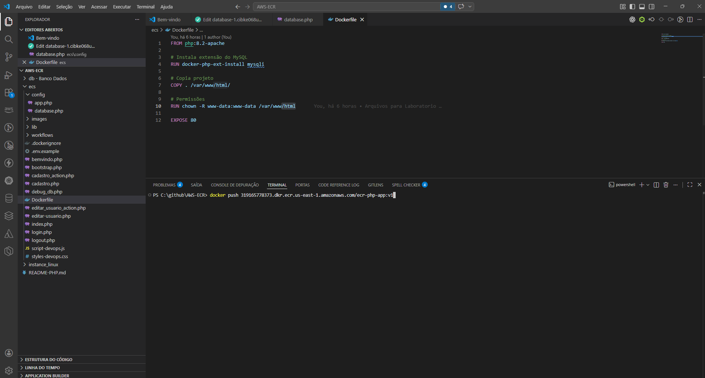
  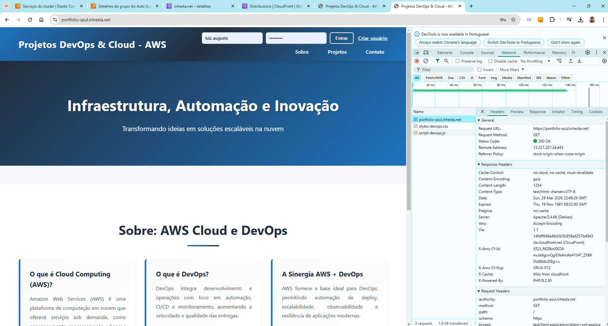
</p>

<p align="center">
  
  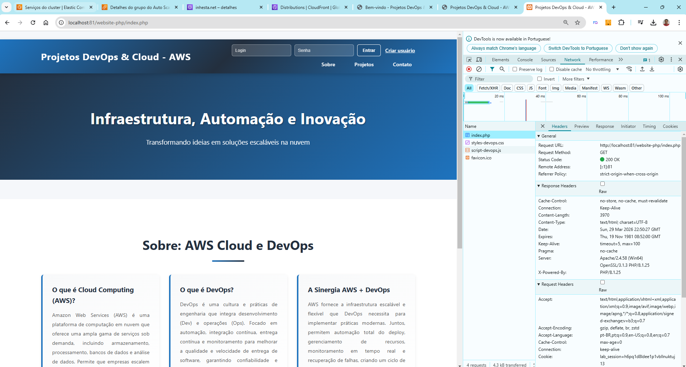
  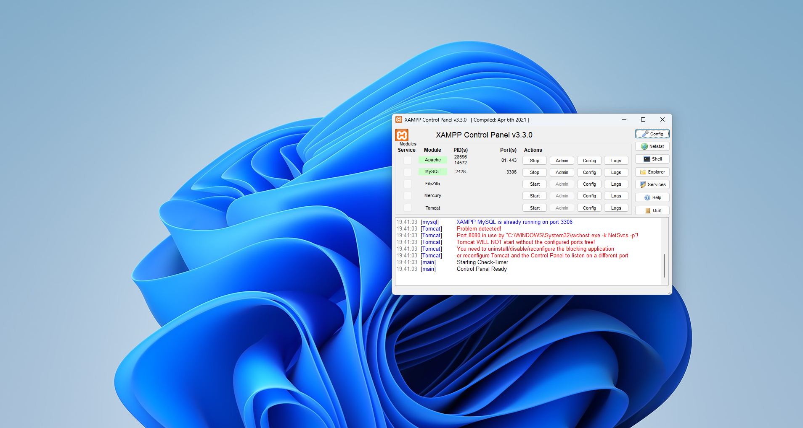
</p>

<p align="center">
  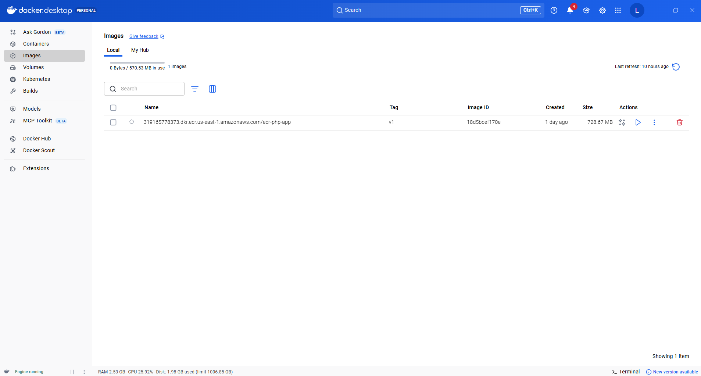
  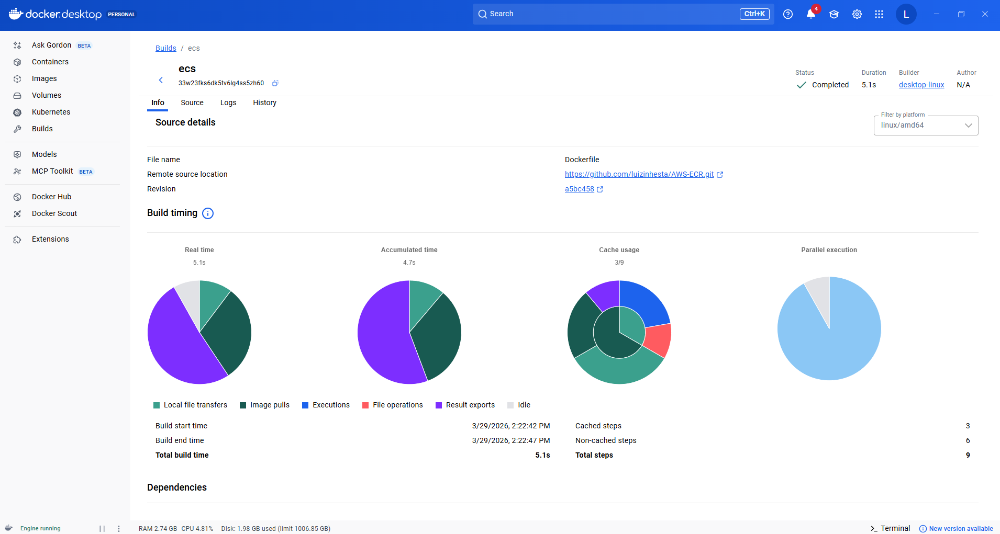
  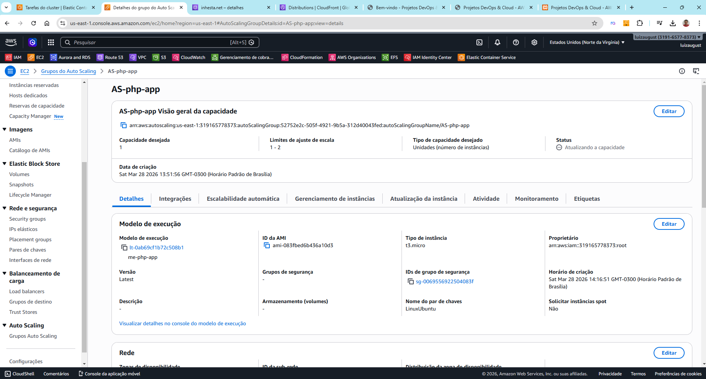
</p>

<p align="center">
  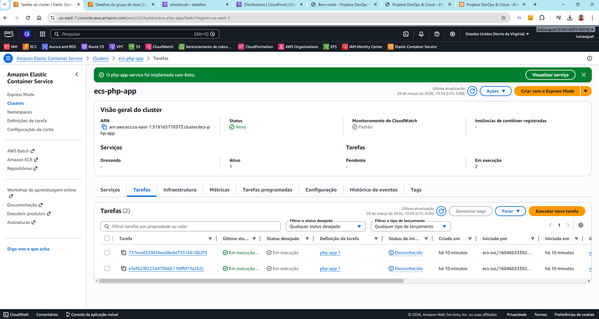
  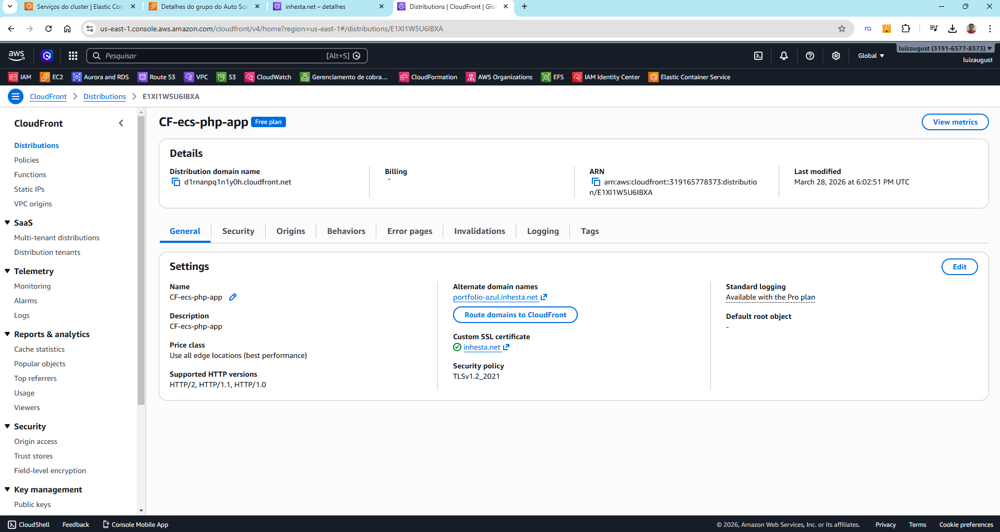
  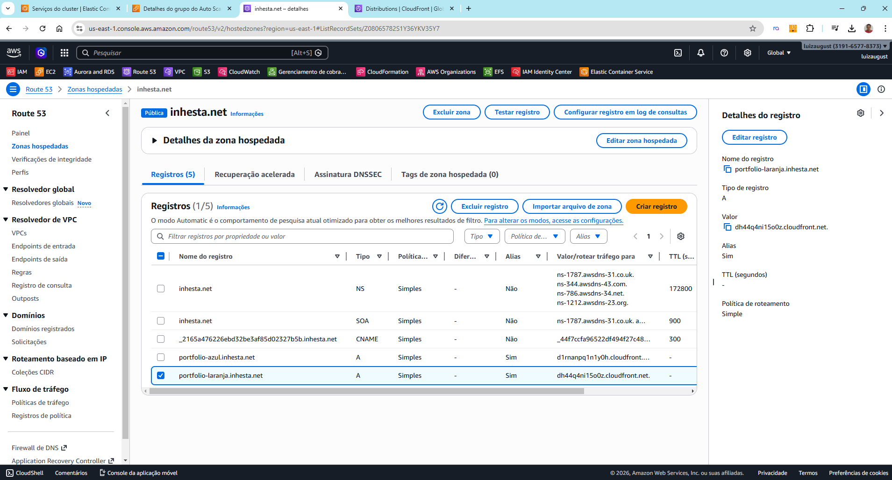
</p>

<p align="center">
  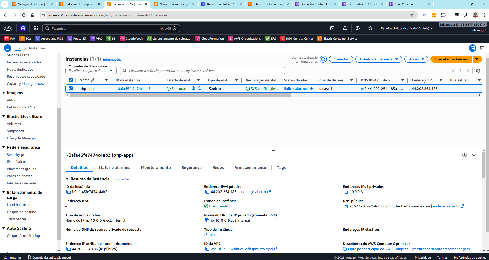
  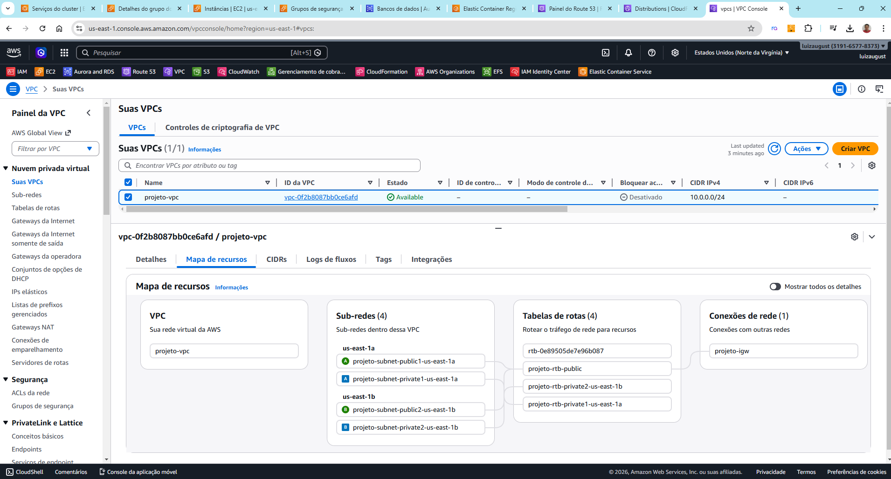
  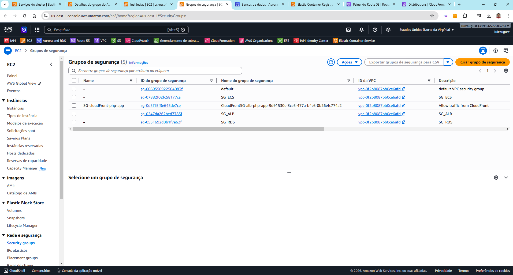
</p>

<p align="center">
  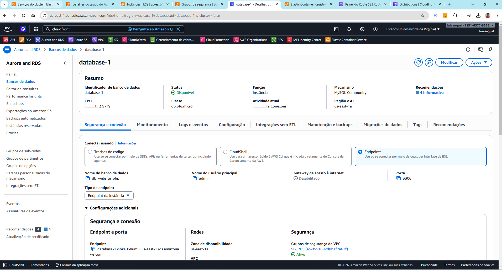
  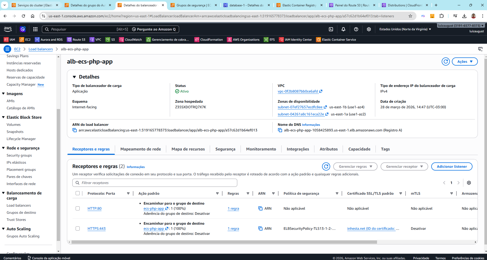
  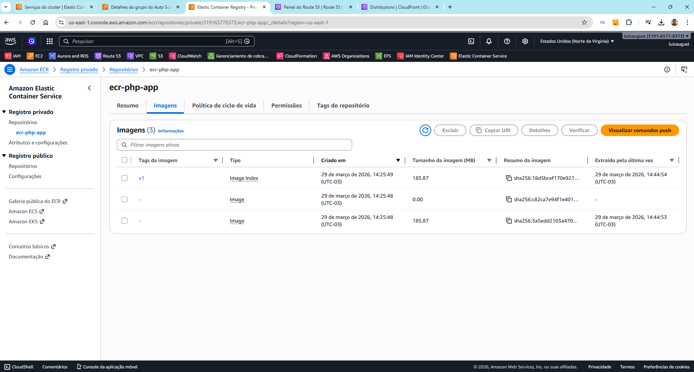
</p>
---

## 📈 Próximos Passos

* 🔄 CI/CD com GitHub Actions
* 🔐 AWS Secrets Manager
* 📊 Monitoramento com CloudWatch
* 📈 Auto Scaling no ECS
* 🔒 HTTPS com ACM
* 🧠 Integração com API Gateway e Lambda

---

## 🎯 Aprendizados

Este projeto permitiu aprofundar:

* Arquitetura AWS
* Containers com Docker
* ECS Fargate
* Segurança em Cloud
* Deploy profissional
* Evolução de sistemas

---

## 👨‍💻 Autor

**Luiz Augusto Souza**

* 💼 LinkedIn: [https://www.linkedin.com/in/luiz-inhesta-341b4b311/](https://www.linkedin.com/in/luiz-inhesta-341b4b311/)
* 💻 Youtube: [https://youtu.be/UGCbGZdiM8Ya](https://youtu.be/UGCbGZdiM8Y)

---

## ⭐ Conclusão

Este projeto representa uma evolução completa:

👉 Local → EC2 → ECS → Arquitetura profissional

Mostrando na prática como transformar uma aplicação simples em uma solução moderna, escalável e preparada para produção.

```

